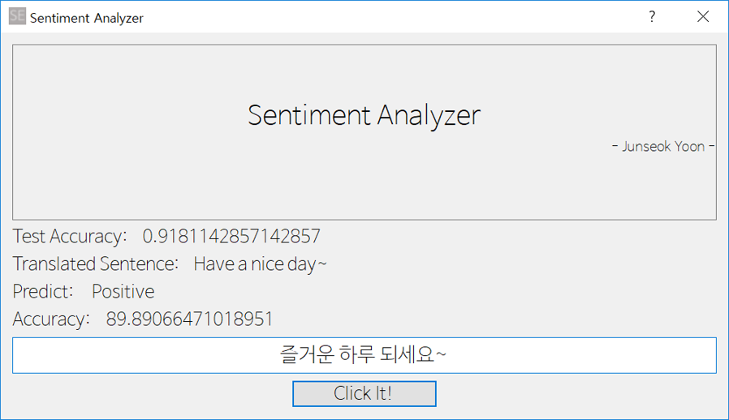

# Sentiment Analyzer

> 프로젝트 진행 시기 - < 2018.06. ~ 2018.08 > 학부 1학년
## 프로젝트 개요

텍스트를 입력 받아 그에 대한 감정을 분석합니다.

텍스트에 대한 감정은 긍정, 부정으로 나뉘며 그에 따른 정확도를 알려줍니다.

텍스트는 영어 또는 한국어가 가능합니다. 한국어는 Papago NMT API를 통해 번역됩니다.

## 사용 기술 스택 및 라이브러리
- Python
  - pandas (데이터 분석)
  - numpy (수치해석)
  - scikit-learn (모델 생성)
  - nltk (nlp)
  - PyQt (GUI)
- Papago NMT API (번역)
  - papago 번역 이용 시 client_id와 secret이 필요합니다.
